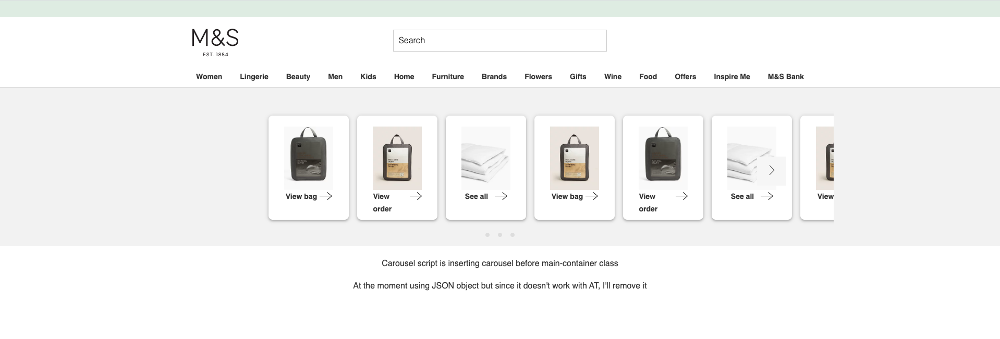

# Carousel-exp236

   

### dashboard that can carousel multiple cards

#### Exp-236 Carousel

----

- Target page(s):  DLP, PLP, PDP
- About experiment:

   - Needs to be a container for the homepage dashboard that can hold multiple cards - each card needs to have it's own rules/logic.
   - If a user has no cards available then the container should not show
   - If multiple cards are shown, then the cards shuld be scrollable sideways
   - Needs to include the greeting and first name (if user signed in)
   - Little X on the cards to remove individual messages - if all messages have been removed by a user, then dashboard should disappear

- Assets:
   • Link to [fonts](https://marksandspencer.invisionapp.com/console/Dashboard-ckniwy5k402qu010l4zea617m/ckniwy7b602qy010lfhcrf0wj/inspect).
   • Link to [design](https://marksandspencer.invisionapp.com/console/Dashboard-ckniwy5k402qu010l4zea617m/ckniwy7b602qy010lfhcrf0wj/inspect).

  

<kbd>Screenshot</kbd>

MS London eText Demibold
MS London eText Semibold
Apple Color Emoji Regular
MS Leeds eText Bold

Layout 375 x 812

#e4e4e4
#d9d9d9
#09C980

rgba(0,0,0,0)
#19322F
#19322F

300x77

.good-afternoon-jesp {
  height: 40px;
  width: 213px;
  color: #000000;
  font-family: "MS London eText";
  font-size: 18px;
  font-weight: 600;
  letter-spacing: 0;
  line-height: 40px;
}

16mt